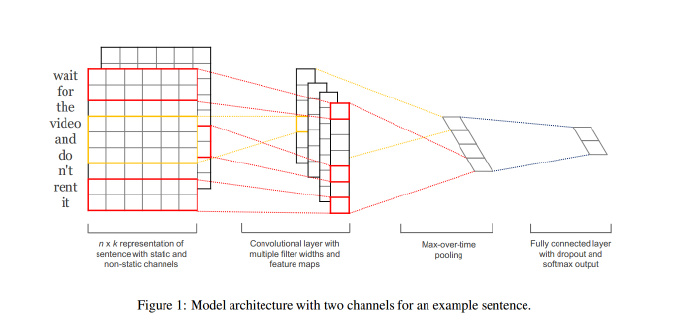

## 主要是使用当下比较流行的深度学习框架进行NLP简单代码的编写

## 主流框架：

      1.tensorflow1.8.0  ---谷歌开源深度学习框架
      2.keras
      3.pytorch      ---Facebook开源的深度学习框架

## 使用的第三方库：

     1.tensorflow
     2.numpy,sklearn,pandas,matplotlib
     3.keras

## 主要通过以下模型进行编写nlp:

   ### NNLM  --2003
   *[参考论文:]

   ### Word2Vec 
     1.CBOW
     2.skip-grams

   ### 3.FastText  --2016

   ### 4.TextCNN   --2014 
   *[参考论文：Convolutional Neural Networks for Sentence Classification](https://arxiv.org/abs/1408.5882)\
   *[实现代码](https://github.com/jiangzhongkai/NLP_From_Zero_to_One/tree/master/TextCNN)\
   *[数据集：搜狗实验室的数据集](https://www.sogou.com/labs/resource/cs.php)\
   
   ### 5.TextRNN

   ### 6.TextRCNN

   ### 7.TextLSTM

   ### 8.BiLSTM

   ### 9.BiLSTM+Attention

   ### 10.Seq2Seq

   ### 11.Seq2Seq+Attention

   ### 12.Transformer

   ### 13.BERT 

   ### 14.HAN(等级注意力网络)
     

## 每个py文件主要是包含：

    1.数据预处理
    2.模型搭建
    3.模型训练
    4.模型保存

## 持续更新中，欢迎fork和关注

