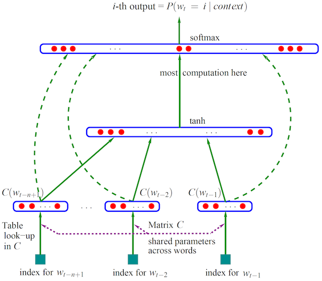
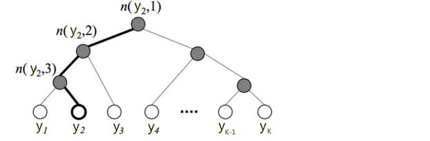
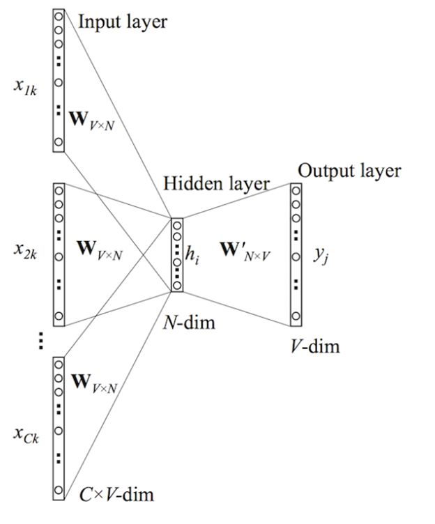
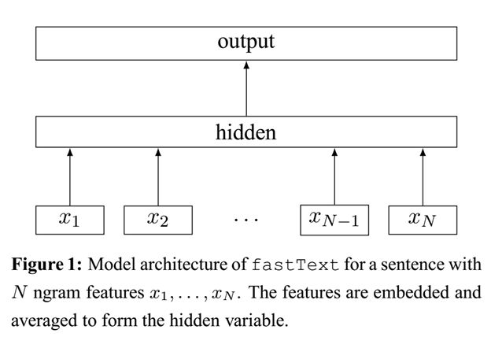
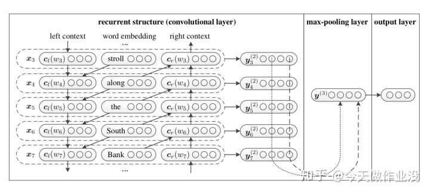
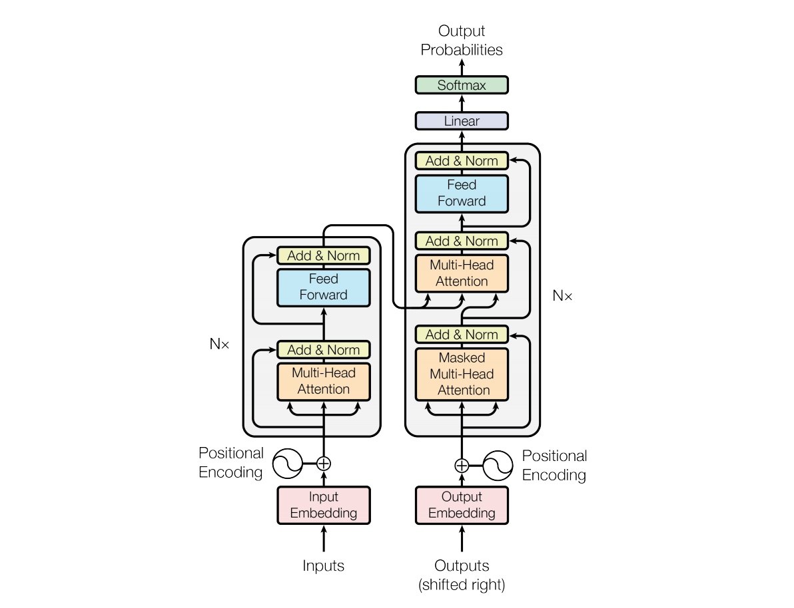
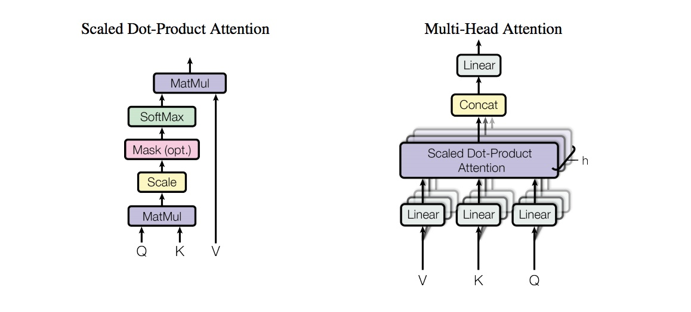

## 主要是使用当下比较流行的深度学习框架进行NLP简单代码的编写

## 主流框架：

      1.tensorflow1.8.0  ---谷歌开源深度学习框架
      2.keras
      3.pytorch      ---Facebook开源的深度学习框架

## 使用的第三方库：

     1.tensorflow
     2.numpy,sklearn,pandas,matplotlib
     3.keras
## 数据集：
   *[数据集：搜狗实验室的数据集](https://www.sogou.com/labs/resource/cs.php)
   
## 主要通过以下模型学习nlp:

### 1.NNLM  --2003

  *[参考论文:A neural probabilistic language model](http://www.pengjingtian.com/2016/09/17/nnlm/)\
  *[实现代码](https://github.com/jiangzhongkai/NLP_From_Zero_to_One/tree/master/NNLM)\
  

### 2.Word2Vec 
------
    1.CBOW
    2.skip-grams

### 3.FastText  --2016
-----
  *[参考论文:]\
  *[实现代码](https://github.com/jiangzhongkai/NLP_From_Zero_to_One/tree/master/FastText)\
  *分级softmax\
  *FatText内部结构\
  *FastText网络结构
    

### 4.TextCNN   --2014 

  *[参考论文：Convolutional Neural Networks for Sentence Classification](https://arxiv.org/abs/1408.5882)\
  *[实现代码](https://github.com/jiangzhongkai/NLP_From_Zero_to_One/tree/master/TextCNN)\
  
  
### 5.TextRNN

### 6.TextRCNN

  *[参考论文:recurrent convolutional neural networks for text classification](https://www.aaai.org/ocs/index.php/AAAI/AAAI15/paper/view/9745/9552)\
  *[实现代码]\
  
  

### 7.TextLSTM

### 8.BiLSTM

### 9.BiLSTM+Attention

### 10.Seq2Seq

### 11.Seq2Seq+Attention

### 12.Transformer

 *The Transformer - model architecture\
 *(left) Scaled Dot-Product Attention. (right) Multi-Head Attention consists of several attention layers running in parallel
### 13.BERT 

### 14.HAN(等级注意力网络)
     

## 每个py文件主要是包含：
     >数据预处理
     >模型搭建
     >模型训练
     >模型保存

## 持续更新中，欢迎fork和关注

## 参考资料
   >[Ateention原理和源码解析](https://zhuanlan.zhihu.com/p/43493999)\
   >[Attention is All You Need](https://arxiv.org/pdf/1706.03762.pdf)\
   >[Seq2Seq+Attention](https://zhuanlan.zhihu.com/p/40920384)\
   >[Transformer详解](https://zhuanlan.zhihu.com/p/44121378)\
   >[BERT详解](https://zhuanlan.zhihu.com/p/46652512)\
   >[BERT: Pre-training of Deep Bidirectional Transformers for Language Understanding](https://arxiv.org/abs/1810.04805)

